# HTB Machine: Pilgrimage

Target IP: 10.10.14.139

My IP: 10.129.145.199

## Reconassense and Vulnerability Assessment

### Port Scanning with NMAP

Add the machine IP address to your /etc/hosts and set domain name to `pilgrimage.htb`

Lets start our assessment with an NMAP scan of the target.

```
sudo nmap pilgrimage.htb -O -sCV -A > nmap.txt
```

About this NMAP command:
* Without specifying a port, the 1000 most common ports are scanned by default
* sCV instructs NMAP to probe each port for its version and run default NMAP scripts against each open port
* -O instructs NMAP to attempt to determine the OS type and version
* -A sets the scan to aggressive mode; this makes the scan louder and more easily detectable by network defenses, but increases volume of useful information

Here's the output:

```
Starting Nmap 7.93 ( https://nmap.org ) at 2023-07-28 16:47 BST
Nmap scan report for pilgrimage.htb (10.129.162.76)
Host is up (0.032s latency).

PORT   STATE SERVICE VERSION
22/tcp open  ssh     OpenSSH 8.4p1 Debian 5+deb11u1 (protocol 2.0)
| ssh-hostkey: 
|   3072 20be60d295f628c1b7e9e81706f168f3 (RSA)
|   256 0eb6a6a8c99b4173746e70180d5fe0af (ECDSA)
|_  256 d14e293c708669b4d72cc80b486e9804 (ED25519)
80/tcp open  http    nginx 1.18.0
|_http-title: Pilgrimage - Shrink Your Images
| http-cookie-flags: 
|   /: 
|     PHPSESSID: 
|_      httponly flag not set
| http-git: 
|   10.129.162.76:80/.git/
|     Git repository found!
|     Repository description: Unnamed repository; edit this file 'description' to name the...
|_    Last commit message: Pilgrimage image shrinking service initial commit. # Please ...
|_http-server-header: nginx/1.18.0


```

Observe the open ports: **22,80**

* 22 is SSH running version OpenSSH 8.4p1 which doesn't appear to be vulnerable
* 80 is HTTP. One of the default NMAP scripts for port 80 found an **exposed Git repository!**

This is the **first vulnerability** of the day! 

Before we start poking around the git repoistory, lets get a feel for the web app itself.

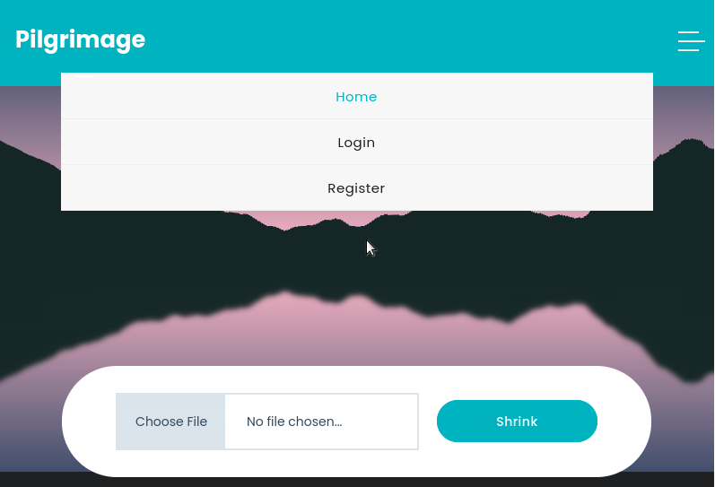

We're greated with a file upload to an image shrinker form. Create an account. The user page after login is a dashboard containing all shrunken image links.  


### We Have Two Options

We can either:
1. Fuzz the file uploader for a file upload vulnerability
2. Check the exposed Git repository for clues

If we can find the source code within the Git repo, it may assist us in finding a file upload vulnerability. 


We visit the repo diectly @ http://pilgrimage.htb/.git but its forbidden. However, if we attempt to visit http://pilgrimage.htb/.git/config/ we can view the Git configuration file. That's interesting.


Searching for some methods to exploiting an exposed Git repository, [we come across this article](https://blog.pentesteracademy.com/mining-exposed-git-directory-in-3-simple-steps-b6cfaf80b89b)


The first method in the article uses git-dumper. It'll basically clone the Git repo. Here's [a Github page detailing git-dumper and its usae cases.](https://github.com/arthaud/git-dumper).

Lets use this tool to dump the Git repo:
1. `pip install git-dumper`
2. `git-dumper http://pilgrimage.htb/ .git`
3. `cd .git`

It's all there!

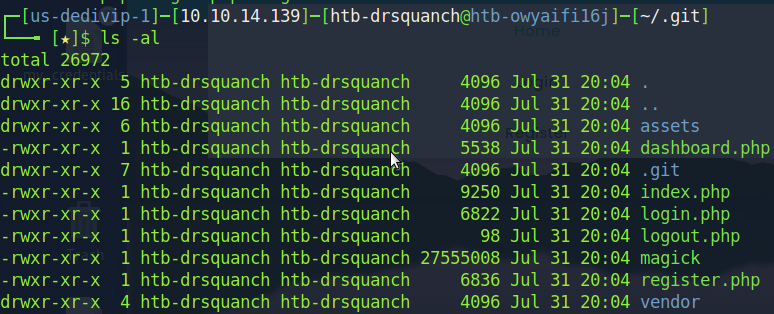

Combing through the PHP files, we come across something interesting:

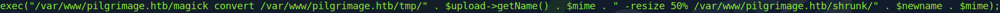

index.php executes our uploaded file with the `magick` binary in the dumper Git repo. 

We see the magick binary is actually ImageMagick 7.1.0-49. 

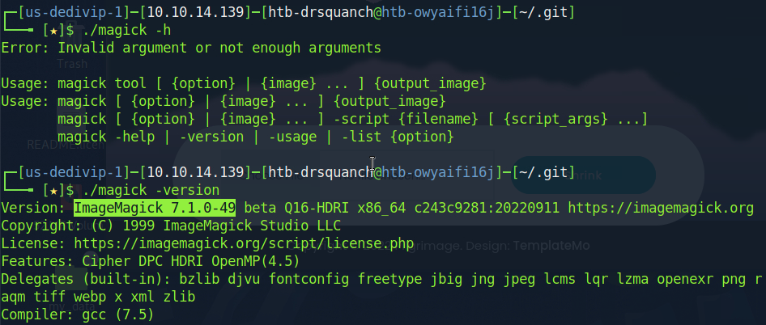

Googling it for known CVEs/vulnerabilies and we come across [this article detailing a vulnerability discovery](https://www.metabaseq.com/imagemagick-zero-days/) as well as [this Github exploit proof of concept (PoC).](https://github.com/voidz0r/CVE-2022-44268).

About ImageMagick 7.1.0-49 vulnerability:
* This version of ImageMagick is vulnerable to arbitrary file read. Meaning we can read most (or all) files on the server
* Arbitrary file read is a high severity level vulnerability, as files and databases can be displayed to a user 


### Resource Development

The PoC provides steps on how to exploit ImageMagick.
1. execute shell command `git clone https://github.com/voidz0r/CVE-2022-44268`
2. change directories to the cloned folder then execute `cargo run "/desired/file`
3. Upload to shrinker website
4. Download resized image
5. execute 'identify -verbose filename-here.png'
6. Convert hex of the resized image body to ascii 

Note: Rust is required to run this exploit - install with: `curl https://sh.rustup.rs -sSf | sh`

Use the steps above as a guide to complete the exploit

Using iPython3, save the hex to a string then decode the hex bytes to an ascii string.

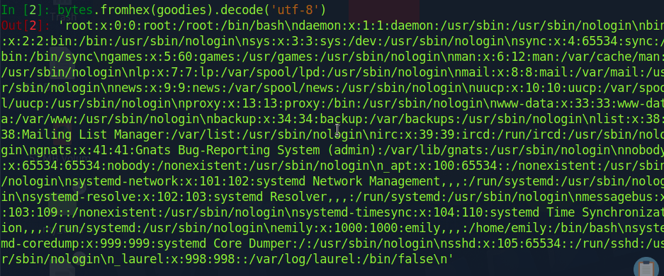

Ok, so if this exploit was the roundhouse kick; we've mastered it. Now, we need to figure out where to deliver the kick. 

Notice the user accounts in `/etc/passwd` file we read from the server. There exsists a user `emily` whose home directory is `/home/emily`. I wonder if we can steal emily's private ssh key

We repeat the steps above with the payload `./cargo run "/home/emily/.ssh/id_rsa"` with no luck. Lets comb the Git repo for interesting files to read. 

### Another Angle: the Database

Notice the login functionality from login.php: it uses SQLite with a prepared SQL statement. The line that catches the eye is the database file is located at `/var/db/pilgrimage`. Lets try to read it. 

Now, deliver the roundhouse kick to the database! Use payload: `./cargo run "/var/db/pilgrimage"`


We have the entire db!

Parse through the null bytes and decode the plain text. Eventually we come acress: 

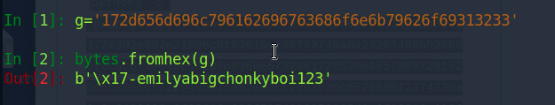


### Initial Access & Execution 

Those appear to be emily's credentials. Try to ssh into her account. 

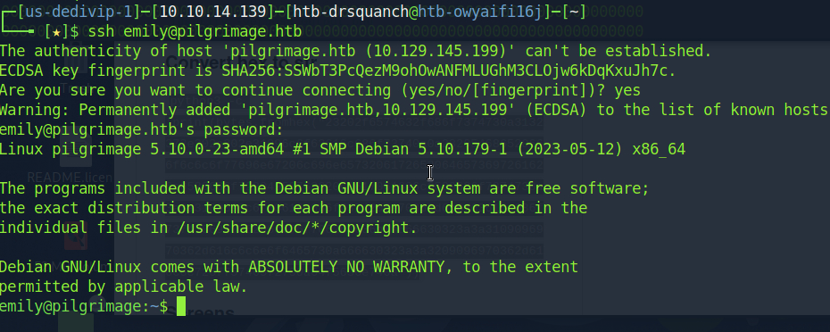


### Priveledge Escalation 

Now that we PWNd user, we need to PWN root. 

After searching the system for abnormalities, we come across one when we list current processes: `ps -aux`
 
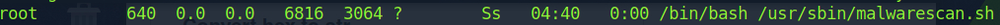

Root is currently runnning a script called malwarescan.sh in `/usr/sbin/`. Lets check it out. 

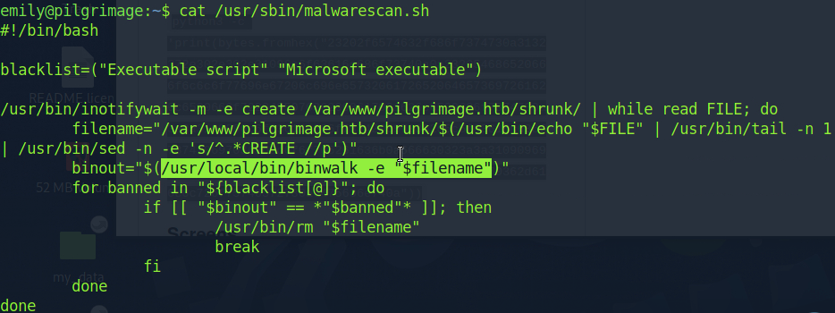

The scirpt calls the binary `binwalk`. When we execute the binary, it tells us it's `Binwalk v2.3.2` 

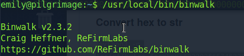

A Google search leads us to exploit-db.com where [we find a PoC for a remote code execution using Binwalk v2.3.2.](https://www.exploit-db.com/exploits/51249)

It looks like the exploit writes a reverse shell to a .png file that Binwalk is vulnerable to.  

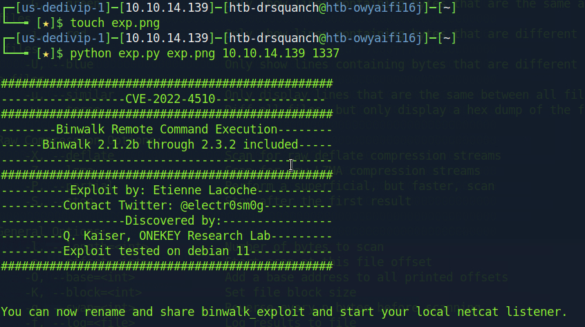

Start a listener for the reverse shell to connect back to.

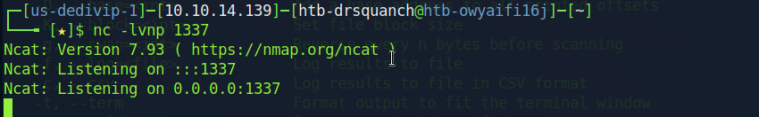

Now start an http server on your machine and download the binwalk_exploit.png file created earlier. Wait a minute or two and keep an eye on your listener...

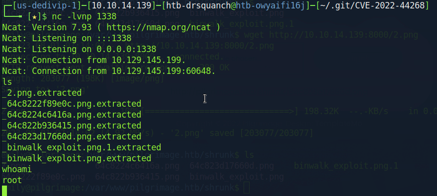

# System Hardening

If we were responsible for this system? What steps could we take to ensure this doesn't happen again?

### Hide or deny access to the exposed Git repository


### Upgrade ImageMagick


### Move SQLDatabase to another machine or Docker Image


### Notify users to avoid password reuse
Once we were able to read the SQLite database file, we found the credentials: `emily:XXXXXXxx`. These were their web appication login credentials, but were the same for system   


### Run MalwareScan with user permissions (emily), NOT root 


### Upgrade Binwalk 


### Upgrade Basket to the latest version
If this was the only vulnerability on the machine, the impact would not be so extreme. However, the fact that this moderately impactful SSRF vulnerability gives us access to an application where we can execute arbitrary commands makes this a **critical** problem.
* Read about [SSRF on the OWASP Top 10 list](https://owasp.org/API-Security/editions/2023/en/0xa7-server-side-request-forgery/)

### Upgrade Maltrail to the latest version
This is a critical vulnerability. Arbitrary command injection is dangerous, as an attacker can transfer file to or from, execte a shell on, or read files from a victim.
* Read about [command injection](https://owasp.org/www-community/attacks/Command_Injection)

### Remove 'puma' user's passwordless sudo
Executing sudo without a user's password is risky. If an attacker steals the sudoers ssh key, executes a reverse on a program they're running, or finds themselves a a terminal left unlocked, they can run the program as sudo. However, if entering the user's password is required prior to execution, that is one more layer of security that would have prevented this privledge escalation. 


